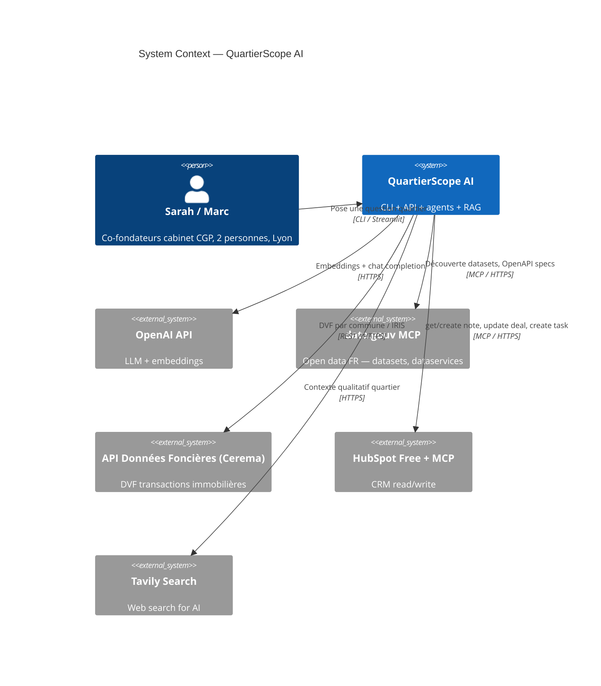
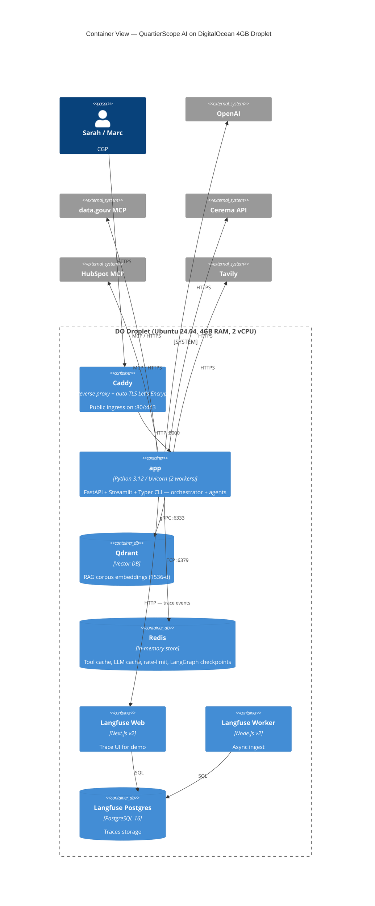
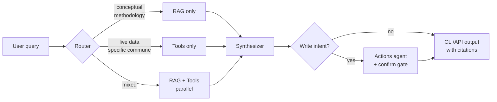
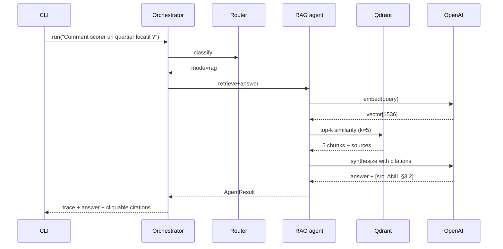
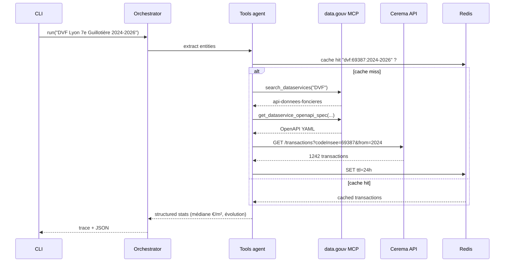
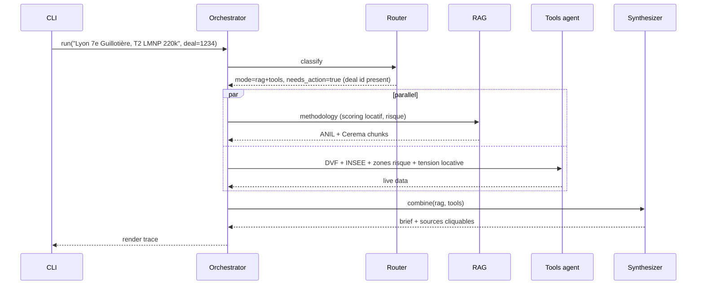
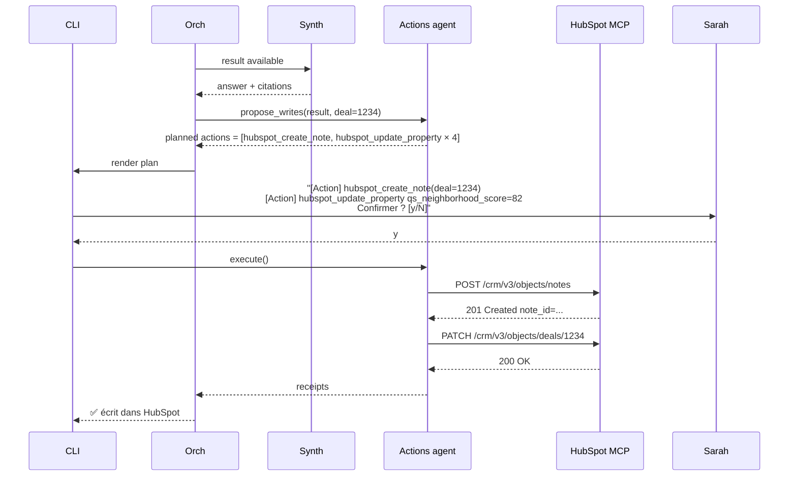
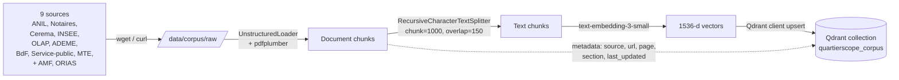
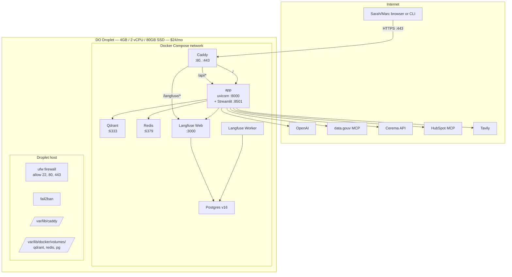

# ARCHITECTURE.md — QuartierScope AI

Companion to `prd.md`. Where the PRD says **what** and **why**, this document says **how** — concretely enough that someone new can read it and start coding.

---

## 1. System overview

QuartierScope AI is a multi-agent AI copilot that produces sourced French neighborhood briefs for a 2-person CGP (Conseil en Gestion de Patrimoine) firm, integrated into HubSpot Free as a CRM-write extension.

Four cooperating AI components, orchestrated by **LangGraph**, exposed through a CLI (primary demo surface) and a thin FastAPI (production surface). Single-host deployment on a **DigitalOcean 4GB droplet** running Docker Compose.

---

## 2. C4 — Context (who talks to what)



---

## 3. C4 — Containers (Docker Compose services on the droplet)



---

## 4. C4 — Components (inside the `app` container)

```mermaid
flowchart TB
    subgraph entry [Entry points]
        cli[Typer CLI<br/>app.cli]
        api[FastAPI<br/>app.api]
        st[Streamlit page<br/>app.streamlit]
    end

    subgraph orch [Orchestration layer]
        run["orchestrator.run query, history<br/>app.orchestrator"]
        graph[LangGraph state machine]
        memory["Memory<br/>(Redis-backed checkpointer)"]
    end

    subgraph agents [Agents]
        router[Router agent<br/>classifies query]
        rag[RAG agent<br/>app.agents.rag_agent]
        tools[Tools agent — read-only<br/>app.agents.tools_agent]
        actions[Actions agent — write<br/>app.agents.actions_agent]
        synth[Synthesizer<br/>combines + cites]
    end

    subgraph toolset [Tool implementations]
        mcp_dg[datagouv_mcp.py]
        mcp_hs[hubspot_mcp.py]
        dvf[dvf.py — Cerema + DuckDB fallback]
        web[web_search.py — Tavily]
        score[scoring.py — neighborhood + yield]
    end

    subgraph data [Data layer]
        qd[(Qdrant<br/>RAG corpus)]
        rd[(Redis<br/>cache + state)]
        duck[(DuckDB<br/>DVF csv.gz cache, fallback)]
    end

    cli --> run
    api --> run
    st --> api
    run --> graph
    graph --> memory
    memory --- rd
    graph --> router
    router --> rag
    router --> tools
    router --> actions
    rag --> qd
    tools --> mcp_dg
    tools --> dvf
    tools --> web
    tools --> mcp_hs
    actions --> mcp_hs
    dvf --> duck
    rag --> synth
    tools --> synth
    actions --> synth
    web --> rd
    dvf --> rd
    mcp_dg --> rd
```

---

## 5. Routing logic

The router is a **single-shot LLM call** with a constrained-output schema (`{mode: "rag" | "tools" | "rag+tools", needs_action: boolean}`). It runs on `gpt-4o-mini` for cost.



### 5.1 Mode 1 — RAG only



### 5.2 Mode 2 — Tools only (DVF flow)



### 5.3 Mode 3 — RAG + Tools (the Sarah scenario)



---

## 6. HubSpot write — the confirmation gate

This is the security-critical flow. **No write tool can fire without explicit user confirmation.**



**Failure modes & handling:**
- User answers `n` or anything ≠ `y` → no writes, full result still rendered
- HubSpot 401/403 → graceful degradation, log to Langfuse, surface error to user
- HubSpot rate-limit (Free tier soft caps) → retry with exponential backoff up to 30s, then fail
- Token absent in env → Actions agent disabled at startup, plan shows "(HUBSPOT_TOKEN absent — désactivé)"

---

## 7. Data flow — RAG ingestion (one-shot)



Run via `python -m app.ingest` — one-shot at deploy time. Re-run quarterly when Notaires de France publishes new conjuncture data.

**Citation enforcement**: every chunk stored in Qdrant carries `metadata.source` + `metadata.url`. The synthesizer prompt is hard-coded to refuse to answer if no source can be cited (PRD §13.2 hallucination control).

---

## 8. Deployment topology



### Memory budget (4GB total)

| Service | RAM target |
|---|---|
| Ubuntu base + Docker daemon | 400 MB |
| Caddy | 50 MB |
| app (uvicorn 2 workers + Streamlit) | 500 MB |
| Qdrant | 600 MB |
| Redis (`maxmemory 100mb`) | 150 MB |
| Langfuse Web (Next.js) | 400 MB |
| Langfuse Worker | 200 MB |
| Langfuse Postgres | 400 MB |
| **Used** | **~2.7 GB** |
| **Free margin** | **~1.3 GB** |

Comfortable. No OOM risk under normal demo load.

### Disk budget (80GB total)

| Item | Size |
|---|---|
| OS + Docker | ~10 GB |
| Qdrant data | ~50 MB (corpus is small) |
| Redis snapshot | <100 MB |
| Postgres (Langfuse) | ~1 GB after 50k traces |
| DVF csv.gz cache (DuckDB fallback) | ~500 MB |
| Logs + journald | ~2 GB rolling |
| **Used** | **~15 GB** |
| **Free margin** | **~65 GB** |

### Boot sequence

```bash
# One-time on fresh droplet
ssh root@<droplet-ip>
apt update && apt install -y docker.io docker-compose-v2 ufw fail2ban
ufw allow 22 && ufw allow 80 && ufw allow 443 && ufw enable
git clone <repo>
cd quartierscope-ai
cp .env.example .env  # then edit secrets
docker compose pull
docker compose up -d
python -m app.ingest        # one-shot RAG corpus indexation
docker compose logs -f app  # verify boot
```

---

## 9. Security architecture

Mapping each PRD §13 control to where it lives in the architecture:

| Threat | Control | Where implemented |
|---|---|---|
| **Prompt injection** ("ignore your rules…") | Strict system prompt + Pydantic input validation (max 2000 chars, charset whitelist) | `app/security.py::validate_query` |
| **Hallucination / unsourced claim** | Synthesizer refuses to answer if no Qdrant chunk passes similarity threshold | `app/agents/rag_agent.py` |
| **Unauthorized CRM write** (prompt-injected `update_deal`) | **Two-agent split + confirmation gate** — write tools only callable by Actions agent, which always renders plan + waits for `y` | `app/agents/actions_agent.py` |
| **Token leak** (`HUBSPOT_TOKEN`, `OPENAI_API_KEY`) | `.env` never committed; `.dockerignore` excludes; Pydantic Settings reads from env only; Langfuse PII redaction enabled | `app/config.py` |
| **CORS open `*`** | Explicit allowlist via `CORS_ALLOWED_ORIGINS` env var | `app/api.py` |
| **Missing security headers** | `secure` package middleware (Python equivalent of Helmet.js): HSTS, X-Frame-Options, CSP, X-Content-Type-Options | `app/api.py` |
| **DoS via burst requests** | `slowapi` with Redis backend, default 10 req/min/IP | `app/api.py` |
| **SSRF via web search** (Tavily returns malicious URL we fetch) | Filter private/loopback IPs before any outbound fetch (Python equivalent of `ssrf-req-filter`); never follow redirects to private ranges | `app/tools/web_search.py` |
| **XML / deserialization attacks** | Use `defusedxml` for any XML parsing; Pydantic for JSON bodies | dependency choice |
| **Catastrophic regex (ReDoS)** | All user-input regex pre-validated via `safe-regex`-equivalent | `app/security.py` |
| **HubSpot Free quota abuse** (e.g. burst note creation) | Per-deal write throttling (max 1 note/min/deal) | `app/agents/actions_agent.py` |
| **Cerema API unavailable** | DuckDB fallback over cached `.csv.gz` | `app/tools/dvf.py` |
| **Container escape / host compromise** | `ufw` open only on 22/80/443; fail2ban on SSH; non-root user in app container | host config |
| **TLS / certificate** | Caddy auto-issues + renews via Let's Encrypt | `Caddyfile` |

---

## 10. Tech radar — decision log

| Layer | Chosen | Rejected | Reason |
|---|---|---|---|
| Language | Python 3.12 | TypeScript | LangGraph + LangChain ecosystem is Python-first; jury graded on Python deliverable |
| Agent framework | LangGraph | CrewAI, plain Python | PRD §8 explicit; conditional routing + visual graph for jury |
| RAG | LangChain + Qdrant | LlamaIndex, pgvector | Qdrant Docker-native, schema-less, Free; LangChain integrates naturally with LangGraph |
| LLM (synth) | OpenAI gpt-4o | Claude Sonnet 4.6, Mistral Large | Best French + tool-calling combo; ~$0.07/query acceptable |
| LLM (router) | OpenAI gpt-4o-mini | Same family Haiku/Mistral Small | Cheap (~$0.001/query) and reliable for classification |
| Embeddings | text-embedding-3-small (1536-d) | bge-m3 (open source) | Cost negligible (one-shot $0.01); env-toggle to bge-m3 retained for "souveraineté" demo |
| MCP — open data | data.gouv MCP officiel | Custom REST wrapper | PRD requirement; official + maintained |
| MCP — CRM | HubSpot MCP officiel | REST direct | Same client infra as data.gouv MCP; reuses code |
| Web search | Tavily | Brave, DuckDuckGo, SerpAPI | Designed for AI agents, clean snippets, generous free tier |
| API | FastAPI (thin) | Flask, Express, Bun | Pydantic validation built-in; uvicorn fast; OpenAPI auto-doc |
| CLI | Typer + Rich | Click, argparse | Rich gives the routing-trace tree the jury sees |
| Web demo | Streamlit | Next.js, Gradio | 1h to build; calls `/query`; renders citations as cards |
| Vector DB | Qdrant | pgvector, Pinecone | Free, self-hosted, fast, schema-less |
| Cache / state | **Redis** | In-process | Multi-worker safe + LangGraph checkpointer + tool TTL cache |
| Observability | **Langfuse v2 self-hosted** | Langfuse v3 (needs ClickHouse, breaks 4GB), Langfuse Cloud | Self-host narrative + fits 4GB; v3 deferred until upgrade |
| Container orchestration | Docker Compose | Kubernetes, ECS | One-host SMB stack; `docker compose up` is the single boot command |
| Reverse proxy / TLS | Caddy | nginx + certbot | Auto-TLS, single config file |
| Hosting | DO Droplet 4GB Premium (NYC3 or AMS3) | Fly.io, Hetzner | $200 GitHub Student credit must be spent before 2026-06-26 |
| Memory backend | Redis-backed LangGraph checkpointer | In-memory dict | Conversation survives restart |
| DVF data path | Cerema API discovered via MCP `search_dataservices` | Direct Cerema, Tabular API, micro-API community | Tabular API spike returned 410; MCP discovery satisfies "MCP mandatory" |
| DVF fallback | DuckDB over local `.csv.gz` | Postgres + COPY | DuckDB reads gzip directly; zero schema work; ~500MB on disk |
| Auth (v1) | None (public droplet IP, no domain) | OAuth, API key | Demo-stage simplicity; production v2 adds Auth0 or HubSpot OAuth |
| Domain | None — IP only | quartierscope.app | User decision; demo URL is `http://<ip>` |
| DO Spaces (S3) | None | $5/mo Spaces | DVF cache lives on droplet disk (only 500MB) |
| CI/CD | GitHub Actions (lint + test + build image) | DO App Platform autodeploy | Stay framework-agnostic; manual `docker compose pull && up` on droplet |

---

## 11. Open architectural questions (to revisit at v2)

1. **Multi-tenant**: today single-tenant. If a 3rd CGP customer signs up, do we deploy per-tenant droplets or migrate to a shared cluster + namespace isolation?
2. **HubSpot OAuth vs PAT**: current plan uses Personal Access Token. Production-grade integration should use OAuth app for proper scope management.
3. **GDPR / data residency**: OpenAI is non-EU. Mistral toggle exists but isn't yet the default. CGP clients may demand EU-only — flip default to Mistral when this becomes a contractual issue.
4. **Langfuse v3 upgrade path**: ClickHouse-needed. Either bump droplet to 8GB or migrate to Langfuse Cloud.
5. **Scaling RAG corpus**: at ~50 sources, re-ingestion gets slow. Move to an event-driven re-index pipeline.
6. **Frontend evolution**: Streamlit is fine for the demo but doesn't survive real usage. Next.js + AI Chat SDK on a separate Vercel deployment is the natural v2.
